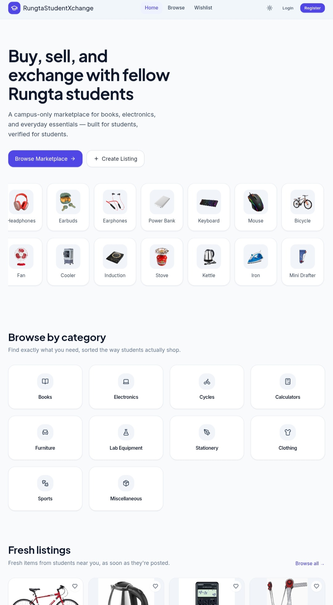
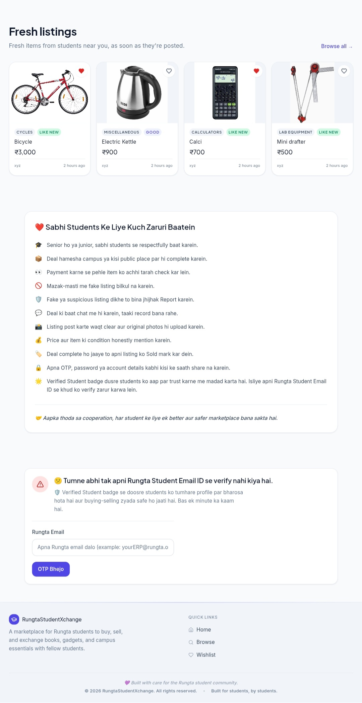
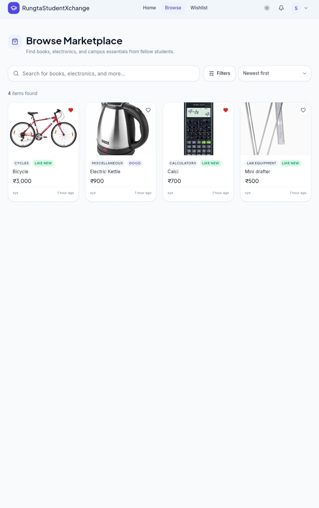
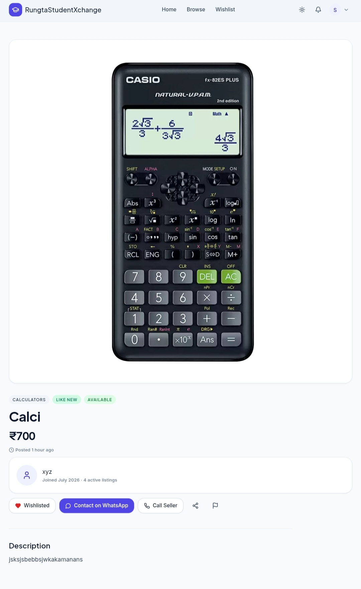
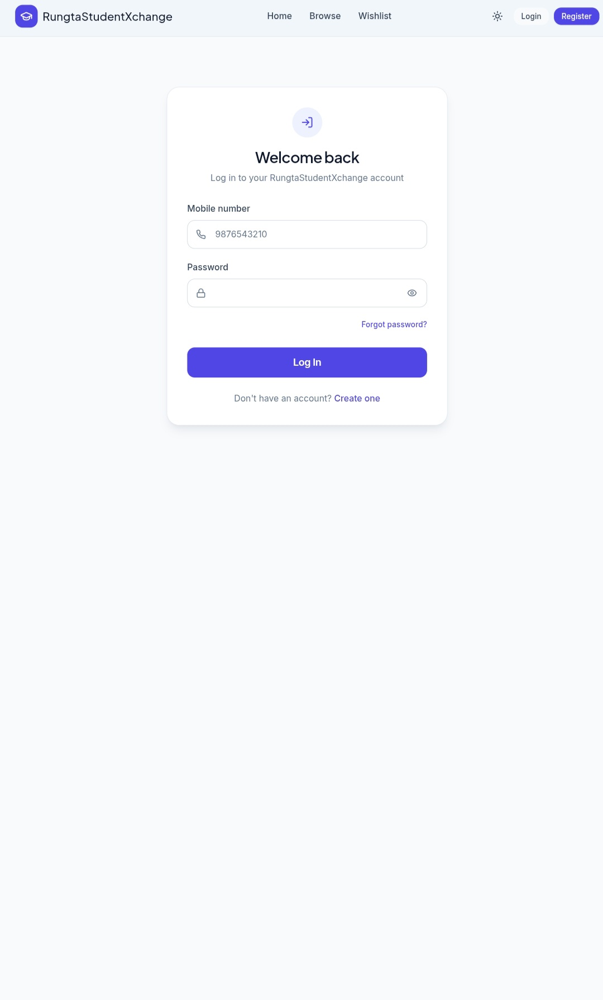
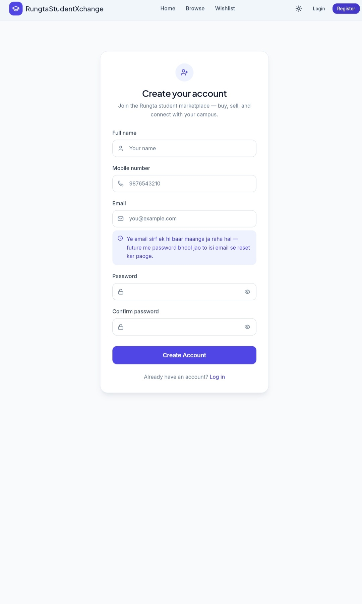
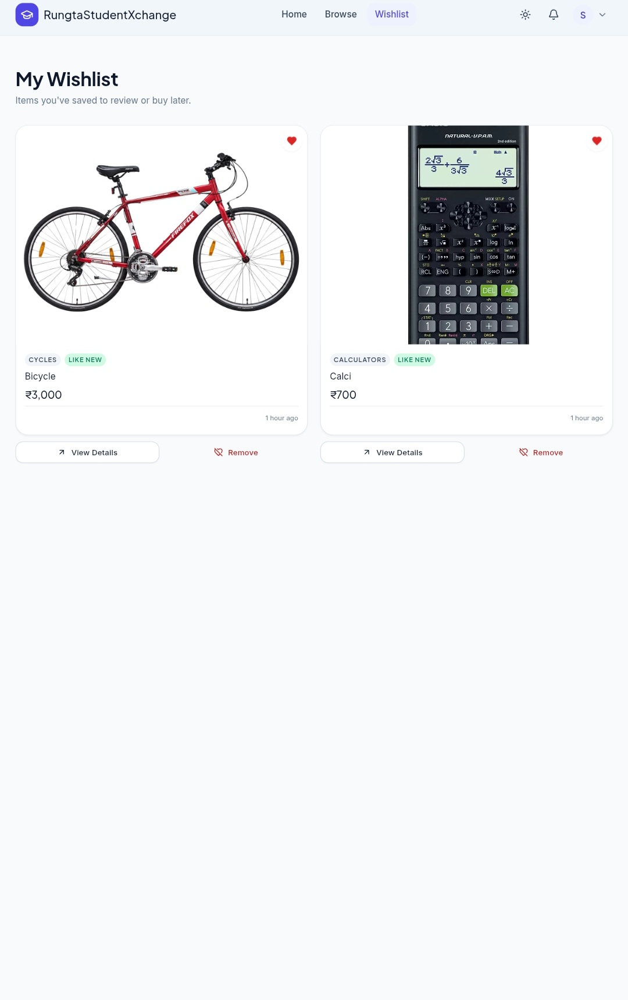
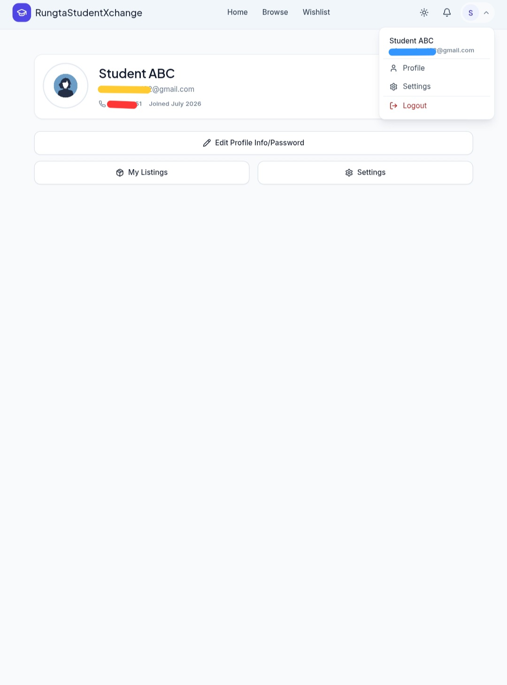
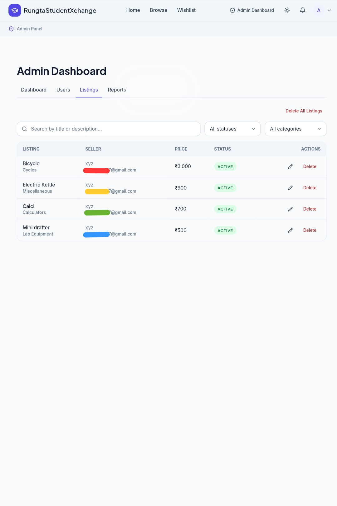

# Rungta Student Xchange

Rungta Student Xchange is a student marketplace built to make buying and selling used items simple, fast, and secure. Students can list products, browse available items, contact sellers directly, and manage everything from a clean and mobile-friendly interface.

The project is built using the MERN stack and is designed to work smoothly on both desktop and mobile devices.

## Live Demo

Frontend:
https://rungta-student-xchange.vercel.app

Backend API:
https://rungtaexchange-backend.onrender.com

---

## Features

### Authentication

- Register and login with JWT authentication
- Forgot password and password reset
- Student email verification using OTP
- Protected routes
- User profile management

### Marketplace

- Create, edit and delete listings
- Upload multiple product images
- Browse all available products
- Search products
- Filter by category, condition and price
- Wishlist support
- Product reporting system
- Related product suggestions

### Seller Features

- View all listings created by a seller
- Contact seller through WhatsApp or phone
- Seller profile information
- Product availability status

### Admin Dashboard

- Dashboard statistics
- Manage users
- Manage listings
- Manage reports
- Visitor analytics
- Delete individual records
- Delete all users, listings, reports and visitor records

### Visitor Analytics

- Visitor permission dialog
- Stores visitor coordinates after permission
- Reverse geocoding for city, state and country
- Google Maps link for every visitor
- Mini map preview
- CSV export

### User Experience

- Responsive design
- Dark and Light theme
- Loading spinner
- Skeleton loading
- Form validation
- Error handling
- Mobile friendly interface

---

## Screenshots

### Home



### Home (Section)



### Browse



### Product Details



### Login



### Register



### Wishlist



### Profile



### Admin Dashboard



---

## Tech Stack

### Frontend

- React
- Vite
- Tailwind CSS
- React Router
- Axios
- Zustand

### Backend

- Node.js
- Express.js
- MongoDB Atlas
- Mongoose
- JWT
- Multer
- Cloudinary
- Nodemailer

---

## Project Structure

```
RungtaStudentXchange
├── frontend
├── backend
├── assets
│   └── screenshots
├── .gitignore
└── README.md
```


---

## Environment Variables

Backend

```
PORT=
MONGO_URI=
JWT_SECRET=
EMAIL_USER=
EMAIL_PASS=
CLOUDINARY_CLOUD_NAME=
CLOUDINARY_API_KEY=
CLOUDINARY_API_SECRET=
CLIENT_URL=
```

Frontend

```
VITE_API_BASE_URL=
```

---

## License

This project is intended for educational and portfolio purposes.

## Author

Md Adnan

GitHub:
https://github.com/MdAdnan098
